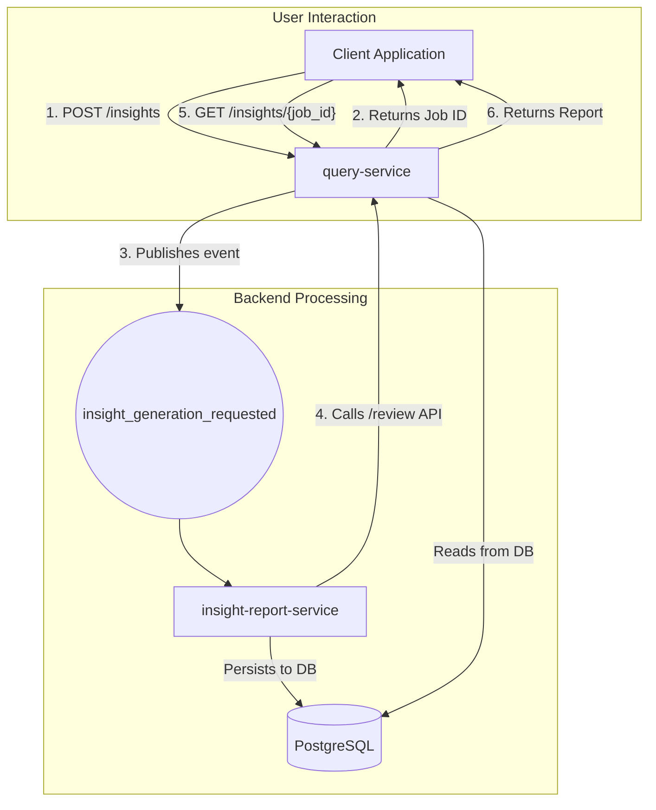

### RFC 009: Personalized Portfolio Insight Reports (NLG)

  * **Status**: Proposed
  * **Date**: 2025-08-30
  * **Services Affected**: `query-service`, New `insight-report-service`
  * **Related RFCs**: [RFC 012](https://www.google.com/search?q=docs/RFCs/RFC%2520012%2520-%2520portfolio-review-api.md)

-----

## 1\. Summary (TL;DR)

This RFC proposes the creation of an enterprise-grade, AI-native pipeline to generate personalized, commentary-driven portfolio insight reports. The goal is to provide Client Advisors with high-quality, narrative talking points, reducing manual preparation time and enabling a scalable "high-touch" client experience.

The architecture introduces a new **`insight-report-service`** microservice dedicated to Natural Language Generation (NLG). An asynchronous API flow will be initiated via a new `query-service` endpoint, **`POST /portfolios/{portfolio_id}/insights`**. This endpoint will queue an insight generation job and return a job ID. The `insight-report-service` will consume a Kafka event, fetch structured portfolio data by calling the `/review` API, and execute a multi-stage **Insight Generation Pipeline** to produce a sophisticated narrative. All generated reports will be persisted for auditability.

-----

## 2\. Motivation

To effectively prepare for client meetings, advisors must analyze complex quantitative reports and synthesize key takeaways and talking points. This is a time-consuming, manual process that is difficult to scale. Automating the generation of high-quality, personalized commentary provides three key benefits:

  * **Advisor Efficiency**: Frees up advisors to focus on client relationships rather than routine data analysis.
  * **Scalable Personalization**: Delivers a bespoke, high-touch experience for every client, regardless of portfolio size.
  * **Quality and Consistency**: Ensures a consistent standard of analytical commentary across the entire advisory team.

-----

## 3\. Architectural Placement & Flow

To ensure the system remains resilient and scalable, the computationally-intensive NLG process will be isolated in a new, dedicated microservice. The interaction will be fully asynchronous to keep the user-facing `query-service` responsive.

  * **New `insight-report-service`**: This new microservice will own all NLG logic. This separation allows it to be scaled independently and prevents long-running generation tasks from impacting the performance of the core `query-service`.
  * **Asynchronous API**: The client will call `query-service` to initiate a job, immediately receiving a `job_id`. This decouples the user experience from the backend processing time.
  * **Service Communication**: The `insight-report-service` will act as a client to the `query-service`. Upon receiving a job request via Kafka, it will call the `POST /review` endpoint to get the necessary structured data. **It will not access the database directly for portfolio analytics**, adhering to our established service boundaries.

**Diagram of the Flow:**



-----

## 4\. The Insight Generation Pipeline

To produce high-quality, auditable, and factually grounded commentary, the `insight-report-service` will implement a multi-stage pipeline. This approach avoids the risks of unconstrained AI by separating deterministic analysis from language synthesis.

### Step 1: Data Aggregation

The service consumes a job request and calls the `POST /portfolios/{portfolio_id}/review` endpoint in `query-service` to get a complete, structured JSON snapshot of the portfolio's state, performance, risk, and allocation.

### Step 2: Structured "Observation" Generation

The service programmatically analyzes the review data to generate a list of structured, machine-readable "Observations." This deterministic, rule-based step identifies statistically significant facts.

  * **Concentration Risk**: The service will analyze the `allocation` data from the review report. It will iterate through breakdowns (e.g., `by_sector`) and compare weights against configurable thresholds (e.g., sector weight \> 30%) to generate `ConcentrationRisk` observations.
  * **Contribution Analysis (v1)**: A full attribution engine is out of scope. Instead, the service will perform "contribution-lite" analysis by comparing the TWR of individual asset classes (available in the review data) to the overall portfolio TWR to identify the main drivers and detractors.

**Example Observation JSON:**

```json
[
  {
    "type": "PerformanceOutperformance", "period": "YTD", 
    "portfolio_return": 0.0825, "benchmark_return": 0.0754, 
    "significance": "moderate"
  },
  {
    "type": "ConcentrationRisk", "asset_class": "Equity", 
    "sector": "Technology", "weight": 0.72,
    "significance": "high"
  }
]
```

### Step 3: Narrative Synthesis (Constrained LLM)

The list of structured Observations is passed to a Large Language Model (LLM). This step uses a carefully engineered prompt that **constrains the LLM to only use the provided facts**, leveraging its power for sophisticated language and flow while preventing factual invention ("hallucinations").

**Example Prompt:**

> "You are a senior portfolio analyst writing a summary for a client advisor. Based *only* on the following structured observations, write a professional, concise summary. Weave the facts into a flowing narrative. Do not introduce any information not present in the observations."

### Step 4: Recommendation Generation

The pipeline generates actionable talking points for the advisor:

1.  **Signal Generation**: The Observations are passed to a rules engine that generates "Signals" for potential recommendations (e.g., `ConcentrationRisk` -\> `ConsiderRebalancing` signal).
2.  **Recommendation Phrasing**: The LLM translates these abstract signals into professional, non-prescriptive talking points.

-----

## 5\. AI Model & Deployment Strategy

Our architecture will be **model-agnostic**, using an abstraction layer so the underlying LLM can be swapped via configuration.

For our initial launch, the recommended approach is a **Cloud-Based API using Azure OpenAI Service**, which offers a balance of state-of-the-art model quality and enterprise-grade security commitments.

  * **Data Privacy Mitigation**: To address privacy concerns, the `insight-report-service` will **never send PII or raw portfolio data to an external API**. Only the anonymized, structured "Observations" (as shown in Step 2) will be sent. This provides a strong security and compliance posture.
  * **Future Option**: For clients with the strictest data residency requirements, the model-agnostic design allows us to swap in an **On-Premise / Private Cloud** model in the future.

-----

## 6\. API Specification (`query-service`)

### Endpoint 1: Initiate Insight Generation

  * **Method**: `POST`
  * **Path**: `/portfolios/{portfolio_id}/insights`

**Request Body:**

```json
{
  "as_of_date": "2025-08-30",
  "sections": ["SUMMARY", "RECOMMENDATIONS"],
  "granularity": "DETAILED"
}
```

**Response Body (202 Accepted):**

```json
{
  "job_id": "a1b2c3d4-e5f6-7890-1234-567890abcdef",
  "status": "PENDING",
  "message": "Insight report generation has been queued."
}
```

### Endpoint 2: Retrieve Insight Report

  * **Method**: `GET`
  * **Path**: `/insights/{job_id}`

**Response Body (200 OK - Complete):**

```json
{
  "job_id": "a1b2c3d4-e5f6-7890-1234-567890abcdef",
  "status": "COMPLETE",
  "portfolio_id": "PORTF12345",
  "as_of_date": "2025-08-30",
  "report": {
    "summary": "Over the past year, the portfolio has returned 8.25%, moderately outperforming its benchmark by 71 basis points. This positive result was driven primarily by a strong allocation to the Technology sector...",
    "recommendations": "* **Discuss Concentration Risk**: Given the significant 72% allocation to the Technology sector, a conversation about trimming this position... could be timely."
  },
  "metadata": {
    "model_version": "azure-openai-gpt-4-v1.0",
    "generated_at": "2025-08-30T12:01:45Z"
  }
}
```

-----

## 7\. Data Model

An Alembic migration script will be created to add two new tables.

**Table: `insight_generation_jobs`**

```sql
CREATE TABLE insight_generation_jobs (
    id UUID PRIMARY KEY,
    portfolio_id VARCHAR(255) NOT NULL,
    as_of_date DATE NOT NULL,
    status VARCHAR(50) NOT NULL DEFAULT 'PENDING', -- PENDING, PROCESSING, COMPLETE, FAILED
    correlation_id VARCHAR(255),
    failure_reason TEXT,
    created_at TIMESTAMP WITH TIME ZONE DEFAULT now(),
    updated_at TIMESTAMP WITH TIME ZONE DEFAULT now()
);
```

**Table: `insight_reports`**

```sql
CREATE TABLE insight_reports (
    id UUID PRIMARY KEY,
    job_id UUID NOT NULL REFERENCES insight_generation_jobs(id),
    portfolio_id VARCHAR(255) NOT NULL,
    as_of_date DATE NOT NULL,
    section VARCHAR(50) NOT NULL, -- e.g., 'SUMMARY', 'RECOMMENDATIONS'
    content TEXT NOT NULL,
    model_version VARCHAR(50),
    generated_at TIMESTAMP WITH TIME ZONE NOT NULL,
    explainability_refs JSONB -- Stores the structured "Observations" used for generation
);
```

-----

## 8\. Implementation Strategy

  * **Phase 1: AI-Native Insight Pipeline**
    1.  Create the `insight-report-service` and the new database tables.
    2.  Implement the asynchronous API endpoints in `query-service` and the new Kafka topic (`insight_generation_requested`).
    3.  Build the **Observation Generation** engine with rules for key performance, risk, and concentration metrics.
    4.  Integrate with **Azure OpenAI Service** via the new NLG abstraction layer to implement the **Narrative Synthesis** and **Recommendation Phrasing** steps.
  * **Phase 2: Enhancements**
    1.  Expand the Observation engine with more sophisticated analytics (e.g., "attribution-lite").
    2.  Add support for multi-language generation.
    3.  Explore fine-tuning models for our specific financial dialect.

-----

## 9\. Deliverables

  * New `insight-report-service` microservice.
  * Updated `query-service` with `/insights` endpoints.
  * Alembic migration script for the new tables.
  * Helm/Kubernetes deployment configurations for the new service.
  * Unit, integration, and end-to-end tests verifying the asynchronous flow and the factual grounding of the generated text.