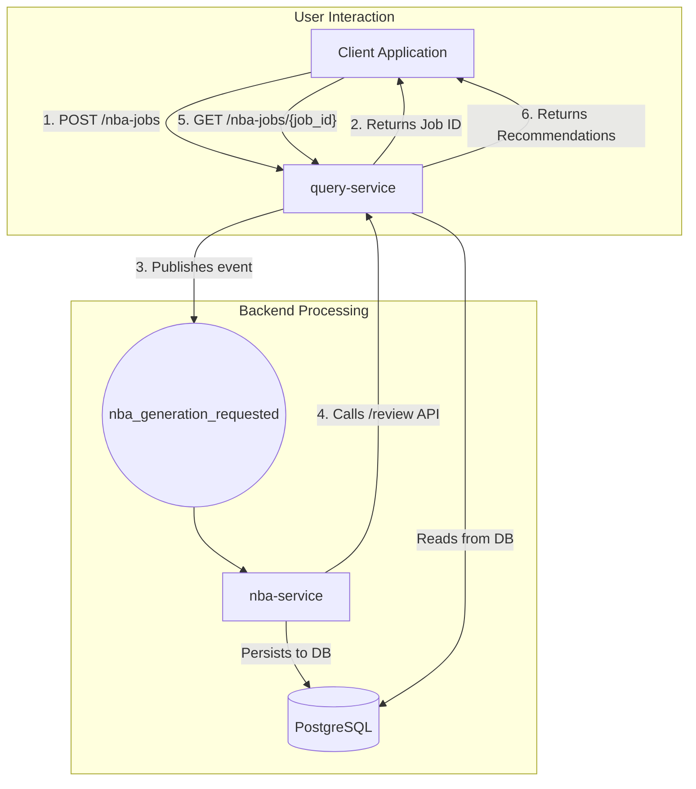

### RFC 011: Next-Best Action (NBA) Client Recommendations

  * **Status**: Proposed
  * **Date**: 2025-08-30
  * **Services Affected**: `query-service`, New `nba-service`
  * **Related RFCs**: RFC 012

-----

## 1\. Summary (TL;DR)

This RFC proposes the creation of an enterprise-grade **Recommendation Intelligence Engine** to provide Client Advisors (CAs) with personalized, commentary-driven, and actionable recommendations for their client portfolios. The system will be delivered via a new, dedicated **`nba-service`** microservice.

Interaction will be asynchronous: a `POST` request to a new endpoint in the `query-service` (`/portfolios/{portfolio_id}/nba-jobs`) will initiate a generation job. The `nba-service` will then execute a multi-stage intelligence pipeline, which involves analyzing portfolio data, detecting signals, scoring potential actions with a machine learning model, and using a Large Language Model (LLM) to generate high-quality, human-readable rationales. The final recommendations will be persisted for auditability and retrieved via a separate polling endpoint.

-----

## 2\. Motivation

Advisors need to proactively identify opportunities and risks within their book of business, but manually analyzing every portfolio daily is not scalable. An automated Next-Best Action (NBA) engine addresses this by:

  * **Enabling Proactive Management**: Surfaces timely and relevant actions, allowing CAs to act on opportunities like rebalancing or hedging.
  * **Improving Advisor Efficiency**: Significantly reduces the time required to prepare for client meetings by pre-calculating key talking points and recommendations.
  * **Driving Consistent Quality**: Ensures a consistent and high standard of portfolio oversight across all clients, based on a centralized, approved set of rules.

-----

## 3\. Architectural Placement & Flow

To ensure the system remains resilient and scalable, the computationally-intensive recommendation process will be isolated in a new, dedicated microservice. The interaction will be fully asynchronous to keep the user-facing `query-service` responsive.

  * **New `nba-service`**: This new microservice will own the Recommendation Intelligence Engine. This separation allows it to be scaled independently and prevents long-running generation tasks from impacting the performance of the core `query-service`.
  * **Asynchronous API Flow**: The client will call `query-service` to initiate a job, immediately receiving a `job_id`. This decouples the user experience from the backend processing time.
  * **Service Communication**: The `nba-service` will act as a client to the `query-service`. Upon receiving a job request via Kafka, it will call the `POST /review` API to get the necessary structured data. **It will not access the analytics database tables directly**, adhering to our established service boundaries.

**Architectural Diagram**:



-----

## 4\. The Recommendation Intelligence Engine

The `nba-service` will implement a multi-stage pipeline to generate sophisticated, auditable, and factually grounded recommendations.

### 4.1. Prerequisite: Context Enrichment

To enable personalized recommendations, the `Portfolio` data model must be enriched with client-specific objectives. A preceding task will be to add the following fields to the `portfolios` table and the corresponding ingestion path:

  * `target_allocation_json`: A JSONB field defining the strategic asset allocation targets (e.g., `{"Equity": 0.60, "Fixed Income": 0.40}`).
  * `income_yield_target`: A numeric field for the client's desired annual income yield.
  * `liquidity_needs_json`: A JSONB field for known future withdrawals.

### 4.2. The Generation Pipeline

1.  **Signal Detection**: The engine analyzes the portfolio data from the `/review` API. It compares current metrics against the portfolio's enriched context (targets, risk profile) to generate structured **Signals**.
2.  **Action Generation & Scoring (ML-based)**: For each Signal, the engine generates candidate **Actions**. From day one, these actions will be scored by a lightweight machine learning model that predicts their relevance based on features like the magnitude of the signal and the client's profile. This allows for intelligent prioritization beyond simple formulas.
3.  **Rationale & Talking Point Generation (LLM)**: The highest-scoring actions are passed to a Large Language Model (LLM). The LLM is constrained to use only the structured data from the action and signal, acting as a sophisticated "copywriter" to generate a nuanced, professional rationale for the advisor.

**Example Transformation:**

  * **Input (Structured Action)**:
    ```json
    {
      "action": "RebalanceEquity", 
      "signal": { "type": "AllocationDrift", "drift_percent": 12 },
      "score": 0.92 
    }
    ```
  * **Output (Human-Readable Recommendation)**:
      * **Title**: "Opportunity to Realign Equity Allocation and Manage Risk"
      * **Rationale**: "The portfolio's current equity allocation has drifted to 72%, which is 12 percentage points above its strategic target of 60%. While recent market performance has driven this growth, this overweight position now exposes the portfolio to a higher level of market risk than is specified in the client's 'Balanced' objective profile."

-----

## 5\. AI Model & Deployment Strategy

Our architecture will be **model-agnostic**, using an abstraction layer so the underlying LLM can be swapped via configuration. For the initial launch, the recommended approach is a **Cloud-Based API using Azure OpenAI Service**.

  * **Data Privacy Mitigation**: To address security and compliance, the `nba-service` will **never send PII or raw portfolio data to an external API**. Only the anonymized, structured "Actions" and "Signals" will be sent for narrative generation.
  * **Future Option**: For clients with the strictest data residency requirements, the model-agnostic design allows us to swap in an **On-Premise / Private Cloud** model in the future.

-----

## 6\. API Specification (`query-service`)

### Endpoint 1: Initiate NBA Generation

  * **Method**: `POST`
  * **Path**: `/portfolios/{portfolio_id}/nba-jobs`

### Endpoint 2: Retrieve NBA Results

  * **Method**: `GET`
  * **Path**: `/nba-jobs/{job_id}`

### Endpoint 3: Submit Feedback

  * **Method**: `POST`
  * **Path**: `/nba/recommendations/{recommendation_id}/feedback`

-----

## 7\. Data Model

Alembic migrations will be created for three new tables.

  * **`nba_generation_jobs`**: Tracks the status of each asynchronous request (`PENDING`, `PROCESSING`, `COMPLETE`, `FAILED`).
  * **`nba_recommendations`**: Stores the generated recommendations for audit and retrieval.
  * **`nba_feedback`**: Stores advisor feedback (`accepted`, `dismissed`) on each recommendation.

-----

## 8\. Implementation Roadmap

  * **Phase 1: Recommendation Intelligence Engine v1**:
      * Build the `nba-service` with the asynchronous job flow and Kafka consumer.
      * Implement the DB schema and prerequisite enrichment of the `Portfolio` model.
      * Develop the **Signal Detection** layer with the full catalog of core rules.
      * Develop an initial **ML-based scoring model** for ranking.
      * Integrate with **Azure OpenAI** for the **Rationale Generation** layer.
      * Build the feedback API to begin collecting training data.
  * **Phase 2: Model Enhancement & Expansion**:
      * Use advisor feedback to retrain and improve the ML ranking model (active learning).
      * Expand the Signal Detection catalog with more complex signals (e.g., tax-loss harvesting).
  * **Phase 3: NLG Integration**:
      * Integrate the generated recommendations into the `insight-report-service` to create a unified narrative report.

-----

## 9\. Observability

The new service will adhere to our established standards:

  * **Structured Logging**: All logs will include `correlation_id`, `job_id`, and `portfolio_id`.
  * **Prometheus Metrics**: `nba_jobs_created_total`, `nba_generation_duration_seconds`, and `nba_feedback_received_total` (labeled by outcome).
  * **Grafana Dashboard**: A new dashboard will monitor the NBA pipeline, including job throughput, latency, and feedback trends.