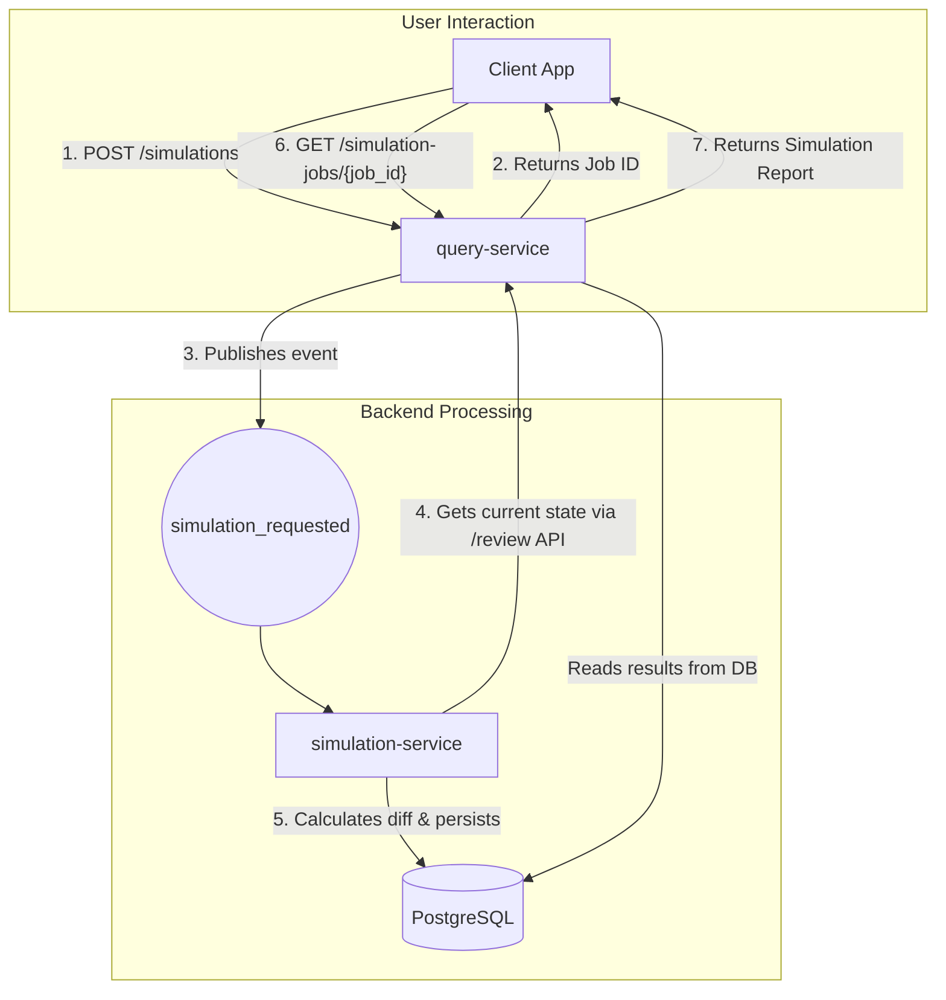

### RFC 013: "Digital Twin" Simulation Engine

  * **Status**: Proposed
  * **Date**: 2025-08-30
  * **Services Affected**: `query-service`, New `simulation-service`
  * **Related RFCs**: RFC 012

-----

## 1\. Summary (TL;DR)

This RFC proposes the creation of a **"Digital Twin" Simulation Engine**, a new capability allowing Client Advisors to model the potential impact of hypothetical trades or cash flows on a client's portfolio *before* execution.

The architecture will introduce a new, dedicated **`simulation-service`** to handle the complex computational logic. The feature will be exposed via an asynchronous API in the `query-service` (`POST /portfolios/{id}/simulations`). An advisor will submit a set of proposed trades, and the system will generate a "diff" report showing the "before" and "after" state of key metrics like asset allocation, concentration risk, and portfolio volatility.

-----

## 2\. Motivation

Advisory conversations are inherently forward-looking. This feature directly supports that by providing a tool to:

  * **Quantify Trade Impacts**: Answer client questions like, "What would happen to my risk profile if we sold this stock and bought another?" with immediate, data-driven analysis instead of intuition.
  * **Enhance Decision-Making**: Allow advisors to test different strategies and visualize their effects on the portfolio's structure and risk characteristics, leading to more informed decisions.
  * **Strengthen Compliance & Suitability**: Provide an auditable record that the advisor considered the impact of a proposed action on the client's portfolio, reinforcing the suitability of their recommendations.

-----

## 3\. Architectural Placement & Flow

Simulating portfolio changes is a distinct, computationally intensive task. To protect the performance of our core analytics, this logic will be isolated in a new microservice. The entire flow will be asynchronous.

  * **New `simulation-service`**: This service will contain the core simulation logic. It will be responsible for creating an in-memory "digital twin" of a portfolio, applying hypothetical trades, and recalculating key metrics.
  * **Asynchronous API**: The `query-service` will provide a non-blocking endpoint to initiate simulations. It will create a job, publish an event to Kafka, and immediately return a `job_id`, allowing the client to poll for the result.

**Architectural Diagram**:



-----

## 4\. API Specification (`query-service`)

### Endpoint 1: Initiate Simulation

  * **Method**: `POST`
  * **Path**: `/portfolios/{portfolio_id}/simulations`

**Request Body:**

```json
{
  "as_of_date": "2025-08-30",
  "hypothetical_trades": [
    { "security_id": "SEC_AAPL", "transaction_type": "SELL", "quantity": 100 },
    { "security_id": "SEC_MSFT", "transaction_type": "BUY", "quantity": 50 },
    { "transaction_type": "WITHDRAWAL", "amount": 25000, "currency": "USD" }
  ]
}
```

**Response Body (202 Accepted):**

```json
{
  "job_id": "f47ac10b-58cc-4372-a567-0e02b2c3d479",
  "status": "PENDING",
  "message": "Portfolio simulation has been queued."
}
```

### Endpoint 2: Retrieve Simulation Report

  * **Method**: `GET`
  * **Path**: `/simulation-jobs/{job_id}`

**Response Body (200 OK - Complete):**

```json
{
  "job_id": "f47ac10b-58cc-4372-a567-0e02b2c3d479",
  "status": "COMPLETE",
  "portfolio_id": "PORTF12345",
  "results": {
    "allocation": {
      "by_asset_class": [
        { "group": "Equity", "before": 0.60, "after": 0.65 },
        { "group": "Fixed Income", "before": 0.40, "after": 0.35 }
      ]
    },
    "concentration": {
      "by_security": [
        { "group": "Apple Inc.", "before": 0.15, "after": 0.12 },
        { "group": "Microsoft Corp.", "before": 0.08, "after": 0.11 }
      ]
    },
    "risk_analytics": {
      "volatility": { "before": 0.158, "after": 0.162 },
      "value_at_risk_99_1d": { "before": 21500.00, "after": 23200.00 }
    }
  }
}
```

-----

## 5\. Data Model

Alembic migrations will add two new tables to manage the asynchronous workflow and store results for auditing.

  * **`simulation_jobs`**: Tracks the lifecycle (`PENDING`, `PROCESSING`, `COMPLETE`, `FAILED`) of each simulation request.
  * **`simulation_results`**: Stores the detailed "before" and "after" JSON report for each completed job.

-----

## 6\. Implementation Details

The `simulation-service` will leverage our existing library-based architecture for maximum code reuse.

1.  **Fetch Current State**: The service will call the `/review` endpoint to get a complete snapshot of the portfolio's current holdings, allocation, and risk metrics. This becomes the **"before"** state.
2.  **Create Digital Twin**: It will load the list of holdings into an in-memory data structure (e.g., a pandas DataFrame).
3.  **Apply Trades**: It will apply the `hypothetical_trades` to this in-memory structure, adjusting quantities and cash balances.
4.  **Recalculate Metrics**: It will use the imported **`risk-analytics-engine`** and our core allocation logic directly on the in-memory "digital twin" to calculate the **"after"** state metrics.
5.  **Generate Diff**: The service will compare the "before" and "after" metrics to generate the final diff report.
6.  **Persist & Complete**: The final report is saved to the `simulation_results` table and the job is marked as `COMPLETE`.

-----

## 7\. Implementation Roadmap

  * **Phase 1: Core Engine & Allocation Impact**:
      * Build the new `simulation-service`, asynchronous API endpoints, and database tables.
      * Implement the in-memory digital twin logic for basic trades (Buy, Sell, Deposit, Withdrawal).
      * Deliver the first set of analytics focusing on the impact to **Asset Allocation** and **Concentration**.
  * **Phase 2: Risk Impact Analysis**:
      * Integrate the `risk-analytics-engine` to calculate the "after" state for key metrics like **Volatility** and **Value at Risk (VaR)**, adding the `risk_analytics` section to the report.
  * **Phase 3: Advanced Analytics**:
      * Expand the engine to model and report on the impact to projected portfolio **income/yield**.
      * Explore a more advanced feature to provide an estimated impact on the portfolio's tax situation (e.g., estimated capital gains from a sale).

-----

## 8\. Observability & Risks

  * **Observability**: The new `simulation-service` will be fully instrumented with structured logging and Prometheus metrics (`simulation_jobs_created_total`, `simulation_duration_seconds`, etc.), complete with a new Grafana dashboard.
  * **Risks**:
      * **Calculation Accuracy**: Simulations are an approximation. The primary risk is that the simplified, in-memory calculation might diverge from the full, stateful pipeline.
      * **Mitigation**: The simulation will be clearly labeled as an "estimate." Furthermore, by reusing the *exact same* core calculation libraries (`risk-analytics-engine`), we minimize the potential for logical drift.