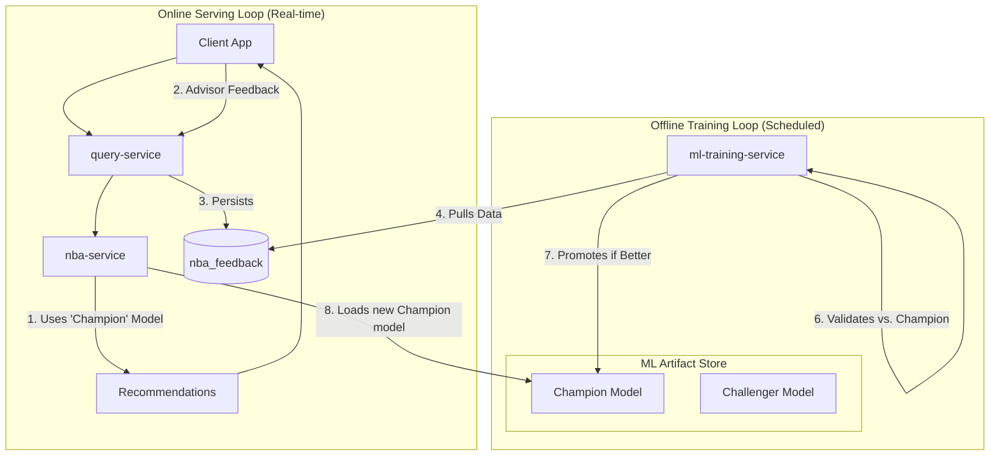

### RFC 014: Active Learning System for Next-Best Action

  * **Status**: Proposed
  * **Date**: 2025-08-30
  * **Services Affected**: `nba-service`, `query-service`, New `ml-training-service`
  * **Related RFCs**: RFC 011

-----

## 1\. Summary (TL;DR)

This RFC proposes the architecture for an end-to-end, closed-loop **Active Learning System** to continuously improve the relevance and accuracy of our Next-Best Action (NBA) engine. This moves beyond simply collecting feedback to creating a fully automated MLOps pipeline.

The system will introduce a new, backend **`ml-training-service`** responsible for periodically retraining our NBA scoring model using the latest advisor feedback. This service will manage a "champion/challenger" process, where new models are only promoted to production if they demonstrate a statistically significant performance improvement. This creates a self-improving ecosystem where the NBA engine adapts to advisor preferences and changing market dynamics, ensuring its recommendations become more valuable over time.

-----

## 2\. Motivation

A static AI model, no matter how good at launch, will inevitably degrade. Advisor needs change, market conditions shift, and new successful strategies emerge. An active learning loop is the only way to ensure our recommendations remain sharp, relevant, and trusted.

  * **Continuous Improvement**: The system automatically learns from the expert judgment of our Client Advisors, ensuring the AI's definition of a "good" recommendation evolves in line with our best-performing humans.
  * **Increased Advisor Trust & Adoption**: When advisors see the system adapting to their feedback and becoming more useful, their trust and adoption of the tool will increase dramatically.
  * **Competitive Moat**: This creates a powerful data network effect. The more the system is used, the more feedback data we collect, and the smarter our models become. This is a significant and defensible competitive advantage.

-----

## 3\. Architectural Vision: The Closed-Loop System

We will build a complete, automated pipeline that creates a virtuous cycle of recommendation, feedback, and model improvement.

**Key Components:**

  * **`nba-service`**: Continues to serve real-time recommendations using the current "champion" model. It will now also store the `feature_vector` used for each recommendation, which is critical for reproducible training.
  * **`ml-training-service` (New)**: A new, asynchronous microservice that wakes up on a schedule (e.g., weekly) or is triggered by an event (e.g., after 1,000 new feedback points are collected). It orchestrates the entire retraining and validation process.
  * **ML Artifact Store**: A dedicated storage solution (e.g., MLflow Tracking Server, S3 bucket) to store versioned models, training datasets, and performance metrics.

**Architectural Diagram**:

-----

## 4\. The Machine Learning Pipeline (`ml-training-service`)

The new service will execute a standard, robust MLOps pipeline.

1.  **Data Preparation**: The service queries the `nba_recommendations` and `nba_feedback` tables to create a labeled training dataset. Each row will consist of the `feature_vector` used at the time of recommendation and a binary label (`accepted` = 1, `dismissed` = 0).
2.  **Model Training**: It uses this dataset to train a new "challenger" model. We will use a powerful and well-understood model like **XGBoost** or **LightGBM**, which are industry standards for this type of classification/ranking task.
3.  **Model Validation (Champion vs. Challenger)**: This is the most critical control step. The new challenger model is evaluated against a held-back test dataset. Its performance (e.g., AUC, Precision@K) is compared to the performance of the current champion model on the *same dataset*.
4.  **Automated Promotion**: The challenger is only promoted to "champion" status if it meets a predefined improvement threshold (e.g., "is at least 2% better on the primary metric"). This prevents model degradation and ensures we only deploy verifiably better models.
5.  **Model Deployment**: The newly promoted champion model, along with its performance metrics and lineage, is versioned and saved to the ML Artifact Store. The `nba-service` is configured to periodically check for and load the latest champion model without requiring a restart.

-----

## 5\. Data Model Enhancement

To enable reproducible training, we must enhance the `nba_recommendations` table.

  * **New Column**: `feature_vector JSONB`: When the `nba-service` generates a recommendation, it will store the exact feature vector used by the scoring model in this column. This is a gold-standard practice that decouples the training process from the live feature generation logic, making our training pipeline far more robust and debuggable.

-----

## 6\. Implementation Roadmap

  * **Phase 1: Foundation & Data Collection (The "Sensor")**
      * Enhance the `nba_recommendations` table with the `feature_vector` column.
      * Modify the `nba-service` to persist the feature vector alongside every recommendation it generates.
      * Implement the `POST /feedback` API and `nba_feedback` table.
      * **Goal**: Begin collecting high-quality training data from day one, even before the automated pipeline is built.
  * **Phase 2: The Training Pipeline (The "Brain")**
      * Build the new `ml-training-service`.
      * Implement the data preparation, model training, and champion/challenger validation logic.
      * Set up the ML Artifact Store.
      * Initially, model promotion can be a manually triggered and reviewed step.
  * **Phase 3: Full Automation (The "Nervous System")**
      * Fully automate the retraining and deployment pipeline, triggered by a schedule or data volume threshold.
      * Implement the mechanism for the live `nba-service` to automatically hot-reload the newest champion model from the artifact store.

-----

## 7\. Risks & Mitigations

  * **Model Drift**: A model's performance can degrade over time as the environment changes.
      * **Mitigation**: The automated retraining loop is the primary defense. We will also implement monitoring to track the live performance of the champion model and trigger an alert if its predictive power drops significantly.
  * **Feedback Sparsity (Cold Start)**: In the beginning, we won't have enough feedback data to train a robust model.
      * **Mitigation**: The initial ML scoring model in the `nba-service` will be a simple heuristic model. The system will collect data in the background, and the automated pipeline will only promote its first true ML model after a sufficient volume of feedback has been gathered.